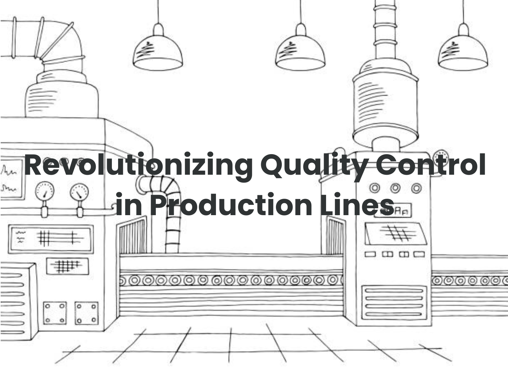

# Utilizing Image Processing and Deep Learning for Casting Classification



This project is an implementation of image processing techniques and deep learning models.

## Overview

In today's industrial landscape, the accuracy of production lines is crucial for efficient manufacturing and product quality. Detecting and preventing defects during production is a key challenge, as manual inspections are time-consuming and error-prone. Image processing and deep learning models offer a solution by automating defect detection in casting manufacturing datasets, significantly improving accuracy.

The application of image processing techniques has enabled deep learning models to achieve a remarkable accuracy rate of 95%, compared to 93.5% with raw images. This enhanced accuracy has substantial benefits, including reduced production of defective castings, improved product quality, increased customer satisfaction, and a strengthened brand reputation. Even small accuracy improvements can lead to significant cost savings in large-scale production lines. Additionally, automated defect detection systems powered by deep learning models accelerate the inspection process, enhancing productivity and resource allocation.

## Dataset:

- The dataset used in this project can be downloaded from [Kaggle](https://www.kaggle.com/datasets/ravirajsinh45/real-life-industrial-dataset-of-casting-product).
     - This dataset focuses on casting manufacturing products and is primarily collected to address the issue of casting defects. Common types of casting defects include blow holes, pinholes, burrs, shrinkage defects, mold material defects, pouring metal defects, metallurgical defects, and more.
- Click on the provided link to access the dataset source page.
- Follow the instructions provided on the webpage to download the dataset files.
- Save the dataset files in a designated folder on your local machine and rename it to **casting_dataset.zip**.

## Environment Setup:

- Ensure that Python is installed on your machine. If not, download and install the latest version of Python from the official [Python website](https://www.python.org).
- Optionally, you can set up a Conda environment by installing Conda from the [Anaconda distribution](https://www.anaconda.com/products/individual).
- Open a terminal or command prompt and create a new Python environment using the desired tool (e.g., `conda create --name myenv or python -m venv myenv`).
- Activate the newly created environment using the appropriate command (`conda activate myenv` or `source myenv/bin/activate`).
- Install the required libraries, packages, and modules by executing the following command:

```bash
pip install -r requirements.txt
```

## Setting up the project:

- Upload the dataset in the same directory and run the command below on your jupyter notebook.

```python
import zipfile
with zipfile.ZipFile("casting_dataset.zip", 'r') as zip_ref:
     zip_ref.extractall("~")
```
- Alternatively, you can open the Notebook implementation and uncomment the first cell.
